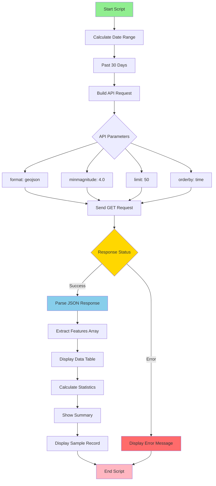

# USGS Earthquake Data Query Script

## 📋 Overview

This Python script queries the **USGS Earthquake Catalog API** to retrieve and display recent earthquake data from around the world. It's designed as a data collection tool for building reporter applications that track seismic activity, analyze earthquake patterns, and generate reports on earthquake frequency and intensity.

**Key Features:**
- ✅ Free public API (no API key required)
- 📊 Retrieves up to 50 recent earthquake records
- 🔍 Filters by magnitude (≥4.0) and date range (past 30 days)
- 📈 Displays summary statistics and formatted data tables
- 🌍 Returns global earthquake data with location coordinates

---

## 🌐 API Endpoint and Parameters

### Base Endpoint
```
https://earthquake.usgs.gov/fdsnws/event/1/query
```

### API Documentation
- **Official Docs**: [USGS Earthquake Catalog API](https://earthquake.usgs.gov/fdsnws/event/1/)
- **Authentication**: None required (public API)

### Query Parameters

| Parameter | Value | Description |
|-----------|-------|-------------|
| `format` | `geojson` | Response format (GeoJSON FeatureCollection) |
| `starttime` | `YYYY-MM-DD` | Start date for earthquake search (30 days ago) |
| `endtime` | `YYYY-MM-DD` | End date for earthquake search (today) |
| `minmagnitude` | `4.0` | Minimum earthquake magnitude filter |
| `limit` | `50` | Maximum number of results to return |
| `orderby` | `time` | Sort order (most recent first) |

---

## 📦 Data Structure

### Response Format: GeoJSON FeatureCollection

The API returns earthquake data in GeoJSON format with the following structure:

```json
{
  "type": "FeatureCollection",
  "metadata": {
    "count": 50
  },
  "features": [
    {
      "type": "Feature",
      "properties": {
        "mag": 5.2,
        "place": "42 km NW of San Francisco, CA",
        "time": 1707523200000,
        "type": "earthquake",
        "tsunami": 0
      },
      "geometry": {
        "type": "Point",
        "coordinates": [-122.4194, 37.7749, 10.5]
      }
    }
  ]
}
```

### Key Fields

| Field Path | Type | Description |
|------------|------|-------------|
| `properties.mag` | Float | Earthquake magnitude (Richter scale) |
| `properties.place` | String | Location description (nearest city/region) |
| `properties.time` | Integer | Unix timestamp (milliseconds) |
| `properties.type` | String | Event type (earthquake, quarry blast, etc.) |
| `properties.tsunami` | Integer | Tsunami warning flag (0 or 1) |
| `geometry.coordinates[0]` | Float | Longitude |
| `geometry.coordinates[1]` | Float | Latitude |
| `geometry.coordinates[2]` | Float | Depth (km) |

---

## 📊 Data Flow Diagram



---

## 🚀 Usage Instructions

### Prerequisites

1. **Python 3.6+** installed on your system
2. **Required Python package**: `requests`

### Installation

Install the required dependency:

```bash
pip install requests
```

### Running the Script

#### Option 1: Direct Execution
```bash
python3 my_good_query.py
```

#### Option 2: Make Executable (Unix/Mac/Linux)
```bash
chmod +x my_good_query.py
./my_good_query.py
```

### Expected Output

The script will display:

1. **Query Parameters** - Date range, magnitude filter, and API endpoint
2. **Data Table** - Formatted table showing:
   - Record number
   - Magnitude
   - Location description
   - Date and time
3. **Summary Statistics**:
   - Total records retrieved
   - Maximum magnitude
   - Minimum magnitude
   - Average magnitude
4. **Sample Record** - JSON structure of one earthquake record

### Example Output

```
======================================================================
USGS Earthquake Data Query
======================================================================

Query Parameters:
  - Date Range: 2026-01-10 to 2026-02-09
  - Minimum Magnitude: 4.0
  - Max Results: 50
  - API Endpoint: https://earthquake.usgs.gov/fdsnws/event/1/query

Fetching data...

✅ Success! Retrieved 50 earthquake records.

======================================================================
#    Magnitude  Location                            Date/Time           
======================================================================
1    5.2        42 km NW of San Francisco, CA       2026-02-08 14:30
2    4.8        15 km E of Tokyo, Japan             2026-02-08 12:15
...

======================================================================

📊 Summary Statistics:
  - Total Records: 50
  - Max Magnitude: 6.4
  - Min Magnitude: 4.0
  - Average Magnitude: 4.73
```

---

## 🔧 Customization

### Modify Query Parameters

Edit the `params` dictionary in the `fetch_earthquake_data()` function:

```python
params = {
    "format": "geojson",
    "starttime": start_date.strftime("%Y-%m-%d"),
    "endtime": end_date.strftime("%Y-%m-%d"),
    "minmagnitude": 4.0,  # Change minimum magnitude
    "limit": 50,          # Change max results (up to 20,000)
    "orderby": "time"     # Options: time, magnitude
}
```

### Change Date Range

Modify the `timedelta` value:

```python
# For past 7 days
start_date = end_date - timedelta(days=7)

# For past 90 days
start_date = end_date - timedelta(days=90)
```

---

## 📝 Notes

- **No API Key Required**: This is a free public API
- **Rate Limits**: The USGS API does not publicly specify rate limits, but be respectful
- **Data Updates**: Earthquake data is updated in near real-time
- **Historical Data**: The API provides access to historical earthquake records dating back decades

---

## 🐛 Troubleshooting

### Common Issues

1. **Connection Timeout**
   - Check your internet connection
   - The script includes a 30-second timeout

2. **No Data Returned**
   - Try lowering the `minmagnitude` parameter
   - Extend the date range

3. **Import Error: requests module not found**
   ```bash
   pip install requests
   ```

---

## 📚 Additional Resources

- [USGS Earthquake Catalog Documentation](https://earthquake.usgs.gov/fdsnws/event/1/)
- [GeoJSON Format Specification](https://geojson.org/)
- [Python Requests Library](https://requests.readthedocs.io/)

---

## 📄 License

This script uses the USGS Earthquake Catalog API, which provides public domain data from the U.S. Geological Survey.

---

**Last Updated**: February 2026
