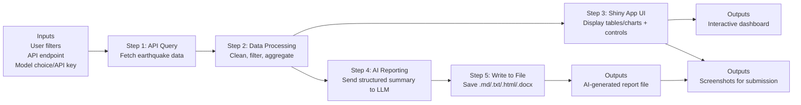

# Process Diagram + Stakeholder Mapping (Draft)

## Process Diagram (Inputs -> Steps -> Outputs)

How to get a screenshot (easy):
1) Open https://mermaid.live
2) Paste the code block above
3) Export as PNG (or screenshot the rendered diagram)

## Stakeholder Needs -> System Goals (Short Mapping)

- Student/User need: Quickly understand recent earthquake patterns
  - System goal: Provide a filterable dashboard (time window, min magnitude, result limit) with clear charts/tables.

- Instructor/Grader need: Verify full pipeline learning (API -> app -> AI -> file output)
  - System goal: Demonstrate an end-to-end workflow and save AI output to a file.

- General reader need: Readable insights (not raw JSON)
  - System goal: Generate a concise report (executive summary, signals, risk watch, caveats, actions).

- Developer/maintainer need: Easy to run and extend
  - System goal: Keep components modular (API query, UI, reporting) and configurable via env vars/settings.

- Security need: Avoid leaking credentials
  - System goal: Store keys in `.env` and ensure `.env` is ignored by git.

